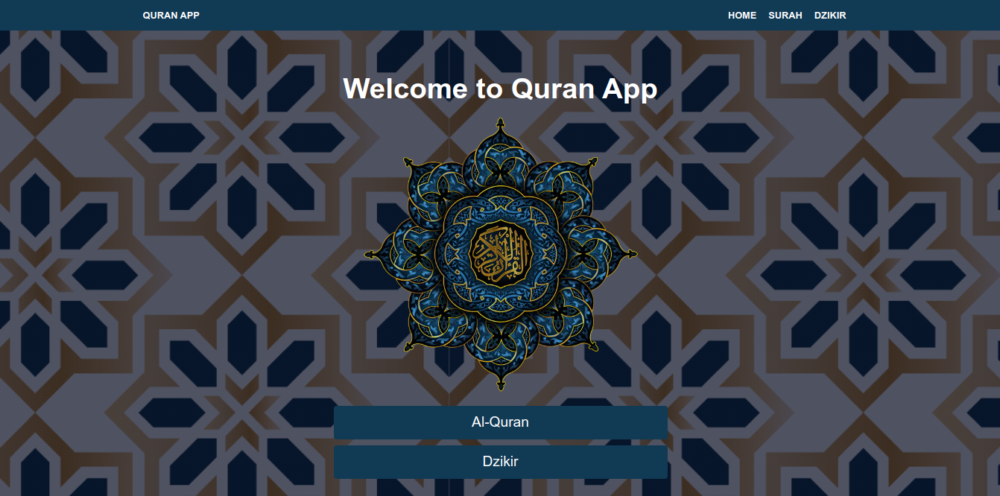
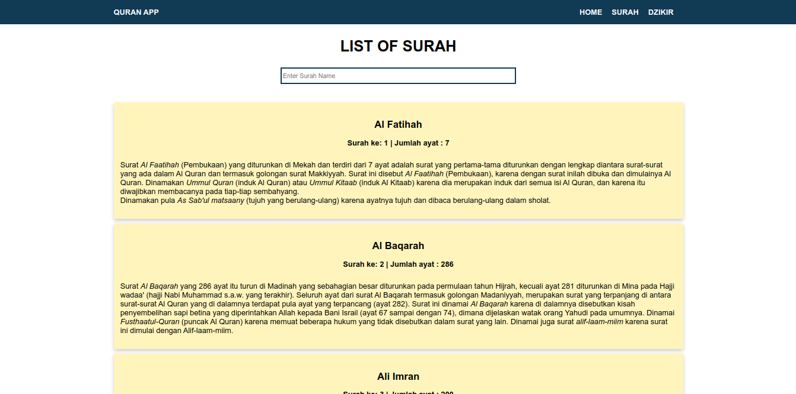
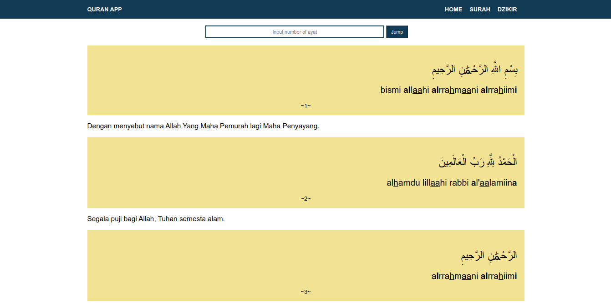

<div align="center">

<!-- PROJECT LOGO -->


</div>

# QURAN WEB APP

<table>
<tr>
<td>
Quran Web App allows users to read the Al-Quran online, via PC, Laptop, or Mobile devices
</td>
</tr>
</table>

## Demo

Here is a working live demo : https://quran-rizalyoga.vercel.app/

## Site

### Homepage



### List Surah Page



### Surah Page



## Run in locale

To clone and run this website, you'll need [Git](https://git-scm.com) and [Node.js](https://nodejs.org/en/download/) (which comes with [npm](http://npmjs.com)) installed on your computer. From your command line:

```bash
# Clone this repository
$ git clone https://github.com/rizalyoga/quran-app.git

# Go into the repository
$ cd quran-app

# Install dependencies
$ npm install

# Run the app
$ npm run dev
```

## Built with

- [Next JS](https://nextjs.org/) - Next.js is an open-source web development framework built on top of Node.js enabling React-based web applications functionalities such as server-side rendering and generating static websites.

- [Vercel](https://vercel.com/) - Vercel is the best place to deploy any frontend app. Start by deploying with zero configuration to our global edge network. Scale dynamically to millions of pages without breaking a sweat.
